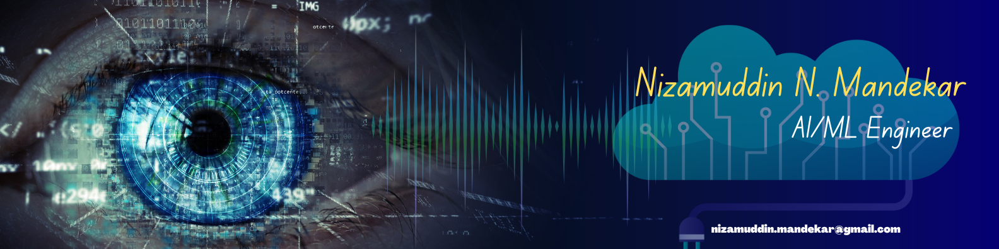

# **✨ Nizamuddin N. Mandekar **

## 🌟 About Me  
Hi there! 👋  
I’m **Nizamuddin Mandekar**, a 💻 Data Scientist and 🤖 Machine Learning Engineer with a Master’s Degree in Artificial Intelligence. I love solving problems and creating smart solutions with **AI** and **ML**. 🌈  

---

## 📂 **Explore My Work**  
📄 [**Resume**](./my_RESUME.pdf)  

---

## 🎓 Education  
| 🎓 **Degree**                       | 🏫 **Institution**                | 📅 **Duration**         | 📈 **Grade/Percentage** |
|-------------------------------------|-----------------------------------|-------------------------|-------------------------|
| 🧠 M.Sc. in Artificial Intelligence | B.K. Birla College (Autonomous)  | Aug 2023 - July 2025    | Pursuing               |
| 💻 B.Sc. in Information Technology  | B.K. Birla College (Autonomous)  | June 2020 - May 2023    | 9.27                   |
| 📖 12th H.S.C Board                 | K.M. Agrawal College             | July 2018 - Feb 2020    | 62.46%                 |

---

## 🛠️ Technical Skills   
- **💻 Programming Languages:** Python 🐍, HTML 🌐, CSS 🎨, Java ☕  
- **📚 Frameworks & Libraries:** TensorFlow 📦, Keras, PyTorch 🔥, Scikit-learn, NumPy, Pandas  
- **🤖 Machine Learning:** Supervised Learning 📊, Unsupervised Learning 🧩, Model Evaluation 🔍  
- **🧠 Deep Learning:** Neural Networks 🧠, CNNs 🖼️, RNNs 🌀  
- **🛠️ Tools & Platforms:** Jupyter Notebook 📒, Google Colab ☁️, Git 🌿, Power BI 📊  
- **📊 Database Management:** MySQL 🗃️, MongoDB 🍃  
- **🖥️ Operating Systems:** Windows 🪟, Linux 🐧  
- **🎨 Other Skills:** Canva 🎨, PPT Design 📑, Video Editing 🎥, Photo Editing 📸  

---

## 👨‍💻 Professional Experience   
### **🌩️ Cloud Counselage Pvt. Ltd.**  
- **Role:** Machine Learning Intern (Remote)  
- **Responsibilities:**  
  - 🛠️ Developed machine learning algorithms for predictive analysis.  
  - 🤝 Collaborated with a team to implement AI solutions.  
  - 🔍 Conducted code reviews and provided feedback.  

### **💡 CodeClause Pvt. Ltd.**  
- **Role:** Artificial Intelligence Intern (Remote)  
- **Responsibilities:**  
  - ⚙️ Built machine learning models for data analysis.  
  - ✨ Conducted data preprocessing and feature engineering.  
  - 🎯 Evaluated model performance and fine-tuned hyperparameters.  

---

## 🏆 Certifications   
- 📘 **Deep Learning** *(By L&T Edutech)* *(Pursuing)*  
- 📕 [**Machine Learning**](https://iggnitewebcertification.lntedutech.com/?certificationID=dzp9JU_WYRUHFTM_267105454540822&name=Nizamuddin%20Naeem%20Mandekar%20&course=Machine%20Learning) *(By L&T Edutech)*  
- 📗 [**Design Thinking and Creativity**](https://iggnitewebcertification.lntedutech.com/?certificationID=dzp9JU_rO0JEigU_334234619920411&name=Mandekar%20Nizamuddin%20Naeem&course=Design%20Thinking%20and%20Creativity) *(By L&T Edutech)*  
- 📘 [**Mastering Microsoft Power BI**](https://www.mindluster.com/student/certificate/16332363245) *(By MindLuster)*  
- 📗 **Arduino** *(By IIT Bombay 🏛️)*  
- 📘 **Inkscape** *(By IIT Bombay 🏛️)*  
- 📕 **GIMP** *(By IIT Bombay 🏛️)*  

---

## 🧑‍🔬 Projects   
- **🔍 [Sentiment Analysis](https://huggingface.co/spaces/NizamuddinMandekar/SentimentAnalysis):**  
  Built a web app to predict sentiment (positive/negative) with confidence scores using a pre-trained model.  
- **🤖 ChatBot Using NLP & GenAI:**  
  Designed a ChatBot using LangChain and Google AI for PDF-based Q&A.  
- **✋ Gesture Recognition System:**  
  Created a real-time gesture detection system using CNNs with TensorFlow and OpenCV.  
- **🏠 Housing Price Prediction:**  
  Developed a machine learning model to analyze factors like location and amenities for price prediction.  

---

## 🏅 Honors & Awards  
- **📄 Research Paper:**  
  1. 🧪 *Classifying Authentic and AI-Generated Images with a Fine-Tuned ResNet50 Model* (In Progress)  
  2. 📜 *[A Survey of Virtual Machine Systems](https://www.doi.org/10.56726/IRJMETS30061): Current Technology* (Published in IRJMETS)  

---

## 🌏 Languages 🌍  
- 🗣️ **English**  
- 🗣️ **Hindi**  
- 🗣️ **Marathi**  
- 🗣️ **Urdu**  

---

## 📬 Contact Me  
- 📍 **Location:** Kalyan, Maharashtra, India 🏡  
- 📧 **Email:** [nizamuddin.mandekar@gmail.com](mailto:nizamuddin.mandekar@gmail.com) ✉️  
- 💼 [**LinkedIn**](https://www.linkedin.com/in/nizamuddin-mandekar-226291219/) 🔗  
- 🧑‍💻 [**Kaggle**](https://www.kaggle.com/nizamuddinmandekar) 📊  
- 🤗 [**Hugging Face**](https://huggingface.co/NizamuddinMandekar) 🤗  

---

## 💡 Summary  
I’m a passionate AI professional 💻 who enjoys tackling challenging data problems 📊 and contributing to innovative solutions ✨. I believe in learning 📚, sharing knowledge 🤝, and making an impact 🌍.  

---

### **🚀 Explore my repositories and connect with me! 🌟**  

--- 
