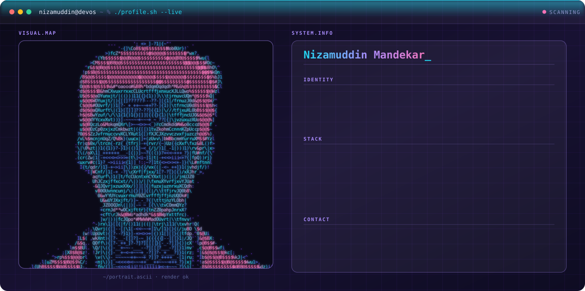

<picture>
  <source media="(prefers-color-scheme: dark)" srcset="assets/banner-dark.svg">
  <source media="(prefers-color-scheme: light)" srcset="assets/banner-light.svg">
  
</picture>

 

 

 

## 👋 Profile

AI Engineer who builds and deploys LLM-powered chatbots and machine learning applications. Skilled in Python, FastAPI, NLP, transformers, and RAG systems, with public-sector delivery experience and a published research record in AI.

---

## 📌 Featured

### [🖥️ portfolio-nizam.os](https://nizamuddinmandekar.github.io/portfolio-nizam.os/)

**An interactive terminal-OS portfolio** boot it up, log in as root, and explore my work the way engineers do: through a shell. Built with React 18, TypeScript, Vite, and Tailwind CSS, with **NIZ.AI**, a built-in chatbot backed by live LLM models, plus offline-ready PWA support.

---

## 🛠️ Tech Stack

 

---

## 📊 GitHub Stats

<picture>
  <source media="(prefers-color-scheme: dark)" srcset="https://github-readme-stats-nizamuddinmandekar-3677s-projects.vercel.app/api?username=NizamuddinMandekar&show_icons=true&theme=radical&hide_border=true&bg_color=0d0b1e&title_color=22d3ee&icon_color=f472b6&text_color=e6e9ff">
  <source media="(prefers-color-scheme: light)" srcset="https://github-readme-stats-nizamuddinmandekar-3677s-projects.vercel.app/api?username=NizamuddinMandekar&show_icons=true&theme=default&hide_border=true">
  
</picture>

<picture>
  <source media="(prefers-color-scheme: dark)" srcset="https://github-readme-stats-nizamuddinmandekar-3677s-projects.vercel.app/api/top-langs/?username=NizamuddinMandekar&layout=compact&theme=radical&hide_border=true&bg_color=0d0b1e&title_color=22d3ee&text_color=e6e9ff">
  <source media="(prefers-color-scheme: light)" srcset="https://github-readme-stats-nizamuddinmandekar-3677s-projects.vercel.app/api/top-langs/?username=NizamuddinMandekar&layout=compact&theme=default&hide_border=true">
  
</picture>

<picture>
  <source media="(prefers-color-scheme: dark)" srcset="https://github-readme-streak-stats.herokuapp.com/?user=NizamuddinMandekar&theme=radical&hide_border=true&background=0d0b1e&ring=22d3ee&fire=f472b6&currStreakLabel=22d3ee">
  <source media="(prefers-color-scheme: light)" srcset="https://github-readme-streak-stats.herokuapp.com/?user=NizamuddinMandekar&theme=default&hide_border=true">
  
</picture>

---

## 🎓 Education

| Degree | Institution | Duration | Grade |
|---|---|---|---|
| M.Sc. Artificial Intelligence | B.K. Birla College (Autonomous) | Aug 2023 – Jul 2025 | 9.26 CGPA |
| B.Sc. Information Technology | B.K. Birla College (Autonomous) | Jun 2020 – May 2023 | 9.27 CGPA |
| HSC (12th) | K.M. Agrawal College | Jul 2018 – Feb 2020 | 62.46% |

---

## 👨‍💻 Professional Experience

<b>🤖 AutomateBuddy Technologies Pvt. Ltd. AI Engineer</b> <i>(Feb 2026 – Present)</i>

 

- Developed and deployed **AskAllen**, an LLM-powered chatbot, using RAG architecture, embeddings, and vector search to improve response accuracy and retrieval efficiency
- Evaluated and integrated LLM models (Qwen, LLaMA variants) and built embedding/vector-storage pipelines in GPU environments, processing 43,000+ resumes into searchable chunks for semantic retrieval
- Built AI review-analytics features for **FudEasy**, including a pipeline ingesting 1,000+ Google reviews for sentiment analysis and an LLM-powered system generating contextual automated replies
- Designed interactive Power BI dashboards tracking monthly, quarterly, and yearly sales/expenses for 2 restaurant clients, cutting manual reporting time
- Deployed and optimized AI services on Windows and Ubuntu servers, ensuring system stability and performance
- Built **QuizBuddy**, a real-time multiplayer quiz platform with three synced React + TypeScript apps (Host, TV, Player) on Firebase Firestore, featuring 6 game modes and a CRUD-managed question bank

<b>💡 SAAR IT Resources Pvt. Ltd. Jr. AI Engineer</b> <i>(May 2025 – Nov 2025)</i>

 

- Worked on WhatsApp integration using FastAPI, Meta WhatsApp Business API, and Ngrok to establish webhook communication
- Contributed to a multilingual e-governance chatbot for the Water Supply and Sanitation Department (WSSD), built with FastAPI, React.js, and LangChain to handle citizen queries in Marathi, Hindi, and English; integrated a SQL database for real-time complaint/service-ticket tracking via unique ticket IDs
- Built a RAG pipeline (TF-IDF + Groq LLM) for context-aware responses, with Whisper (STT) and gTTS (TTS) for voice interaction

---

## 🧑‍🔬 Projects

- **🧠 [AI Image Detector](https://github.com/NizamuddinMandekar/ImageDetector)** *(Final-Year Project)* Classifies real vs. AI-generated images with 92%+ accuracy. [Live demo](https://huggingface.co/spaces/NizamuddinMandekar/ImageDetector)
- **💬 AskAllen** *(Company Project)* LLM-powered recruitment chatbot. [Live](https://askallen.cxengine.net)
- **🎮 QuizBuddy** Real-time multiplayer quiz platform with synced Host, TV, and Player apps, 6 game modes, and a CRUD-managed question bank

---

## 🏆 Certifications

- 📘 Deep Learning *(2025 L&T EduTech)*
- 📕 Machine Learning *(2024 L&T EduTech)*

---

## 🏅 Honors & Awards

**Research Papers**
1. [*AI vs Reality: Classifying Synthetic Faces with a Fine-Tuned ResNet50 Neural Network*](https://doi.org/10.38124/ijisrt/25jul706) Published in IJISRT, Vol. 10, Issue 7 (Jul 2025)
2. [*A Survey of Virtual Machine Systems: Current Technology*](https://www.doi.org/10.56726/IRJMETS30061) Published in IRJMETS

---

## 📬 Contact

📍 Kalyan, Maharashtra, India&nbsp;&nbsp;·&nbsp;&nbsp;📧 [nizamuddin.mandekar@gmail.com](mailto:nizamuddin.mandekar@gmail.com)&nbsp;&nbsp;·&nbsp;&nbsp;🗣️ English · Hindi · Marathi · Urdu

